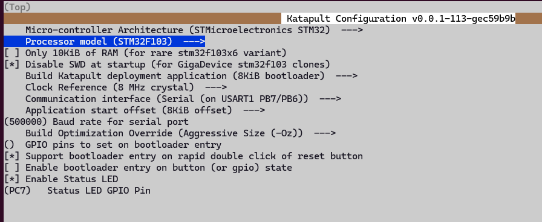
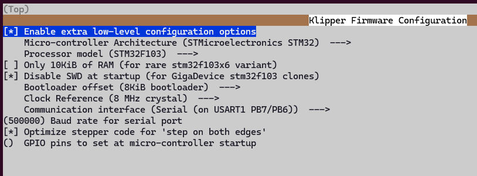

# FLASH MCU - TOOLHEAD

IF: 
```
double clicking "Reset" button twice doesn't work
```

TRY:
```
HOLD: "Boot" button
THEN PRESS: "Reset" button
```

OR TRY:
```
HOLD: "Reset" button
THEN PRESS: "Boot" button
```


