# INSTALL FROM SCRATCH
> ## 1.) DOWNLOAD BASE IMAGE:
> - ### [https://github.com/Shadowrom2020/Qidi-X-6-X-7-Armbian/releases](https://github.com/Shadowrom2020/Qidi-X-6-X-7-Armbian/releases)
> ### TRUNK IMAGES
> **(no 3D printer software installed, just the base Host OS image)**
> - #### [https://github.com/Shadowrom2020/Qidi-X-6-X-7-Armbian/releases/download/26.05.0-trunk/Armbian-unofficial_26.05.0-trunk_Qidi-x6_trixie_current_6.18.21.img.xz](https://github.com/Shadowrom2020/Qidi-X-6-X-7-Armbian/releases/download/26.05.0-trunk/Armbian-unofficial_26.05.0-trunk_Qidi-x6_trixie_current_6.18.21.img.xz)
> - #### [https://github.com/Shadowrom2020/Qidi-X-6-X-7-Armbian/releases/download/26.05.0-trunk/Armbian-unofficial_26.05.0-trunk_Qidi-x6_trixie_edge_7.0.0-rc7.img.xz](https://github.com/Shadowrom2020/Qidi-X-6-X-7-Armbian/releases/download/26.05.0-trunk/Armbian-unofficial_26.05.0-trunk_Qidi-x6_trixie_edge_7.0.0-rc7.img.xz)
> ### FreeDi Beta IMAGE
> - #### [https://github.com/Shadowrom2020/Qidi-X-6-X-7-Armbian/releases/download/FreeDi-Beta/Armbian-unofficial_26.05.0-trunk_FreeDi_trixie_current_6.18.19.img.xz](https://github.com/Shadowrom2020/Qidi-X-6-X-7-Armbian/releases/download/FreeDi-Beta/Armbian-unofficial_26.05.0-trunk_FreeDi_trixie_current_6.18.19.img.xz)
> 

---

> ## 2.) DOWNLOAD & INSTALL Win32 Disk Imager
> - #### [https://sourceforge.net/projects/win32diskimager/files/latest/download](https://sourceforge.net/projects/win32diskimager/files/latest/download)
> 

---

> ## 3.) FLASH BASE IMAGE TO EMMC:
> [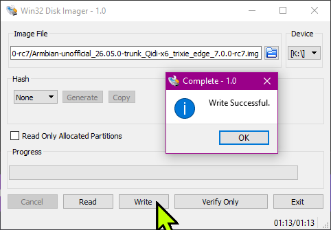](_IMAGE__Win32DiskImager_FlashEMMC.png)
> 
> [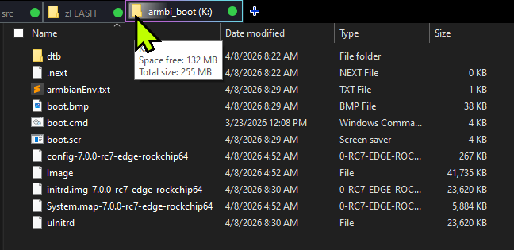](_IMAGE__EMMC-AFTER-FLASHING-TRUNK-OS.png)
> 

---

> ## 4.) FIRST BOOT  --  LOGIN AS ROOT VIA SSH:
> **INITIAL HOST NAME WILL BE `qidi-x6`**
>
> **MAC ADDRESS WILL BE RANDOM, CHECK YOUR ROUTER'S DHCP LEASES TO FIND IP ADDRESS GIVEN ON FIRST BOOT AND CREATE A STATIC DHCP RESERVATION FOR IT IN YOUR ROUTER**<br><br>
> **SSH IN USING `root @ <IP_ADDRESS>`**
> <br>
> **WITH DEFAULT PASSWORD `1234`**
> [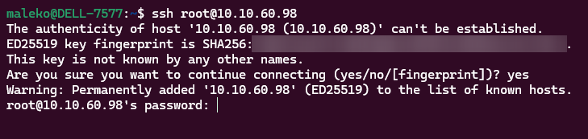](_IMAGE__First-Login-Initial-SSH.png)
> <br><br>
> **PROCEED TO SET UP INITIAL BOOT ENVIRONMENT & NON-ROOT USER:**
> [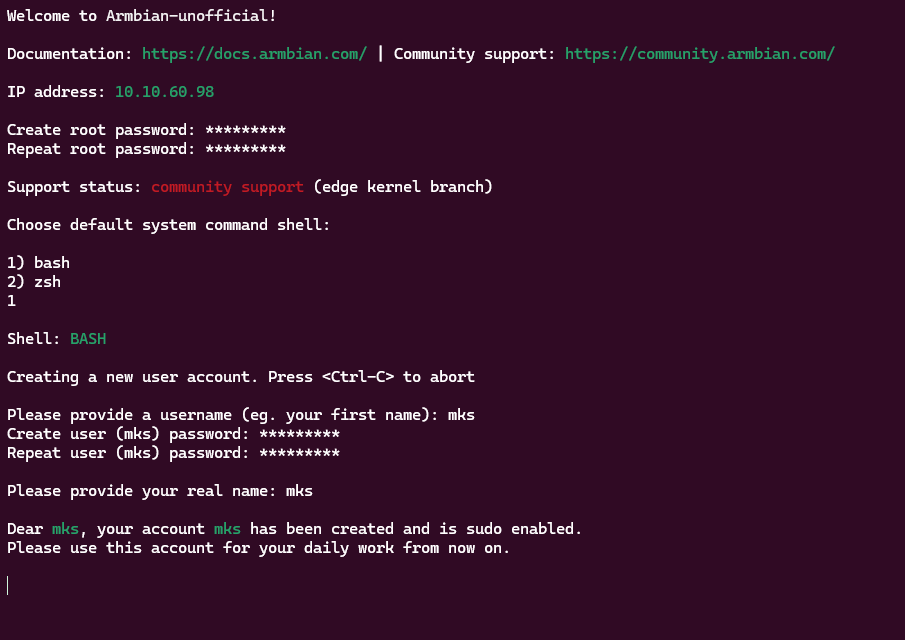](_IMAGE__First-Login-User-Creation.png)
> [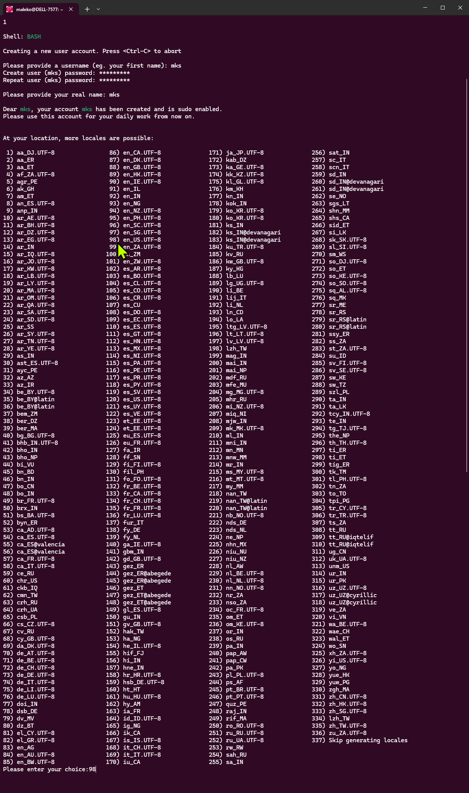](_IMAGE__Select-Locale.png)
> [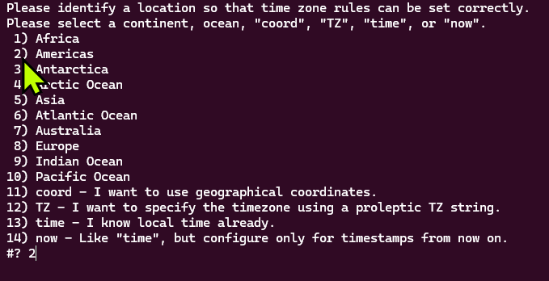](_IMAGE__Select-Time-Zone.png)
> [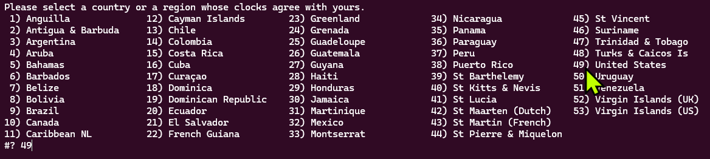](_IMAGE__Select-Country.png)
> [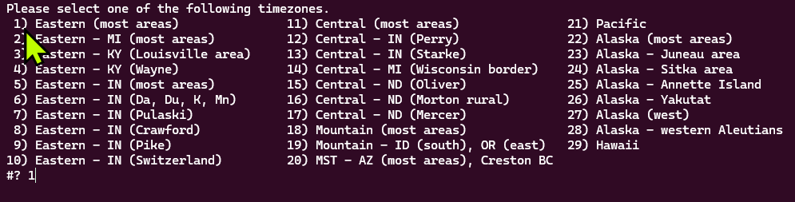](_IMAGE__Select-Local-Time-Zone.png)
> [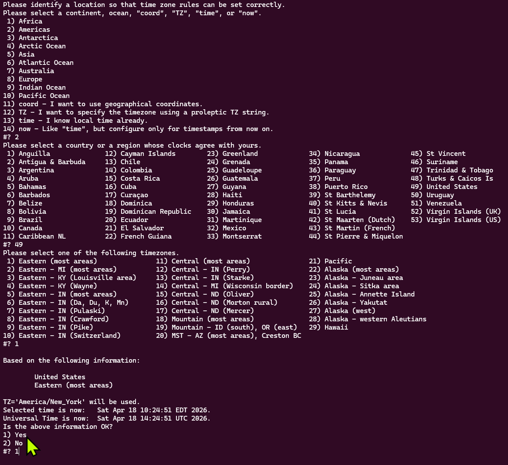](_IMAGE__Confirm-Time-Zone.png)
> [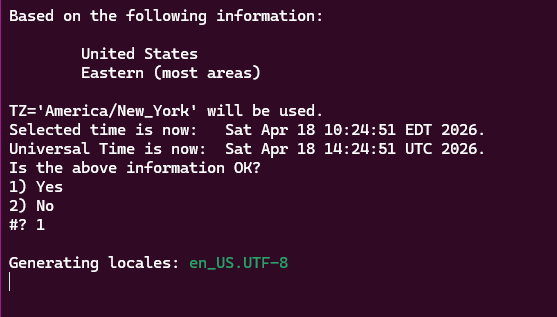](_IMAGE__Generating-Locales.png)
> [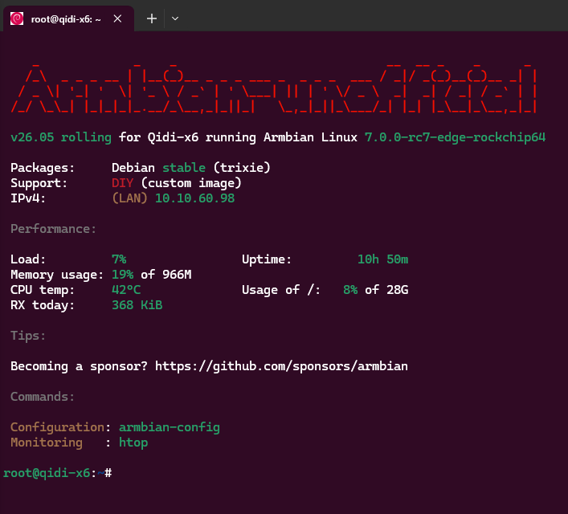](_IMAGE__First-Root-Login-After-Setup.png)

---

> ## 5.) SHUTDOWN PRINTER, REBOOT ROUTER, & LOG IN TO PRINTER AS NON-ROOT USER VIA SSH
> **SHUTDOWN USING THE COMMAND**
> ```
> sudo shutdown -h now
> ```
> [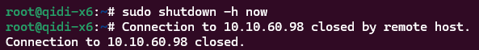](_IMAGE__Shutdown-Printer.png)
> <br><br>
> **ADJUST YOUR ROUTER'S DHCP RESERVATION FOR DESIRED IP ADDRESS IF NECESSARY.**
> <br><br>
> **REBOOT YOUR ROUTER WHILE YOUR PRINTER IS POWERED OFF.**
> <br><br>
> **ONCE YOUR ROUTER IS BACK UP, POWER ON YOUR PRINTER AGAIN.**
> <br><br>
> **LOG INTO PRINTER AT YOUR KNOWN, SPECIFIED, RESERVED IP ADDRESS AS THE NON-ROOT USER YOU CREATED EARLIER.**
> <br><br>
> **NOTE:<br>IF YOU HAVE ALREADY SSH'd INTO YOUR PRINTER AT THE SAME IP ADDRESS IN THE PAST YOU WILL GET THE FOLLOWING ERROR**
> [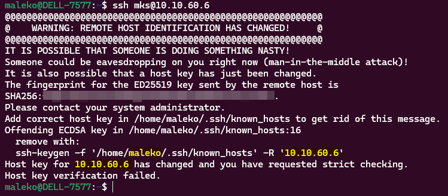](_IMAGE__SSH-Login-Error.png)
> <br><br>
> **RUN THE CODE SNIPPET PROVIDED BY THE TERMINAL TO FIX**
> <br>
> <hint>(don't forget to swap out the `<USER>` and `<IP_ADDRESS>` for your own or just copy and paste the provided snippet as is from your terminal)</hint>
> <br>
> ```
> ssh-keygen -f '/home/<USER>/.ssh/known_hosts' -R <IP_ADDRESS>
> ```
> [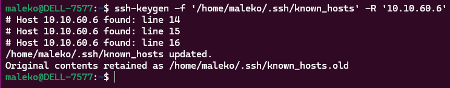](_IMAGE__Fix-SSH-Error.png)
> <br><br>
> **LOG IN AS NON-ROOT USER**
> [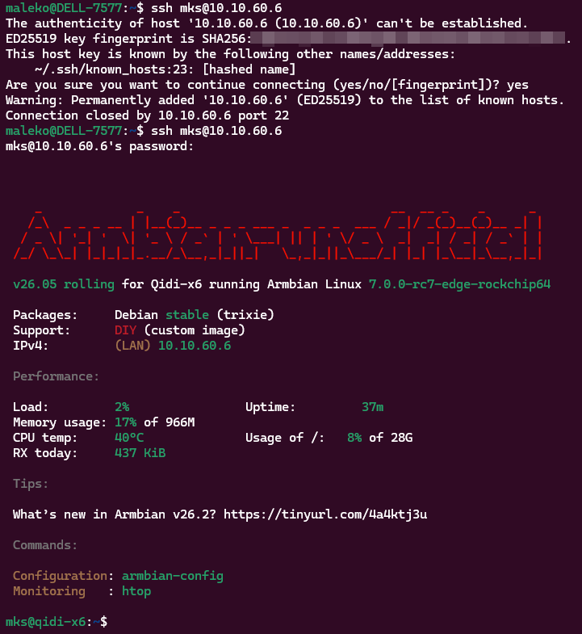](_IMAGE__First-Login-As-User.png)

---

> ## 6.) UPDATE HOST NAME
> **SET THE NEW HOSTNAME**
> ```
> sudo hostnamectl set-hostname qidi-plus4
> ```
> [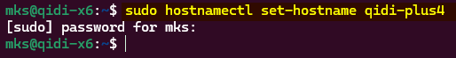](_IMAGE__Set-Hostname-Qidi-Plus4.png)
> <br><br><br>
> **MANUALLY UPDATE THE `/etc/hosts` FILE TO PREVENT ERRORS**
> ```
> sudo nano /etc/hosts
> ```
> [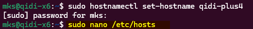](_IMAGE__Nano-etc-hosts.png)
> <br><br><br>
> **UPDATE LINE #2 & #3 TO READ `qidi-plus4`**
> [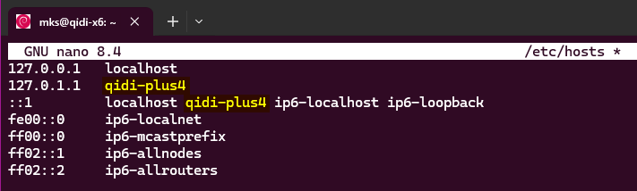](_IMAGE__Update-Hosts-File-Using-Nano.png)
> 
> **PRESS `CTRL + X`**
> 
> [](_IMAGE__Nano-Footer.png)
> **PRESS `Y`**
> 
> [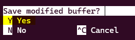](_IMAGE__Nano-Save-On-Exit.png)
> 
> **PRESS `ENTER` TO SAVE & WRITE THE CHANGES OUT TO THE HOSTS FILE**
> 
> [](_IMAGE__Nano-Write-To-File.png)
> [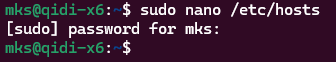](_IMAGE__After-Hosts-File-Update.png)
> <br><br>
> **REBOOT THE PRINTER'S MAINBOARD OS USING `sudo reboot`**
> 
> **SSH BACK IN AS NON-ROOT USER WITH UPDATED HOST NAME**
> 
> [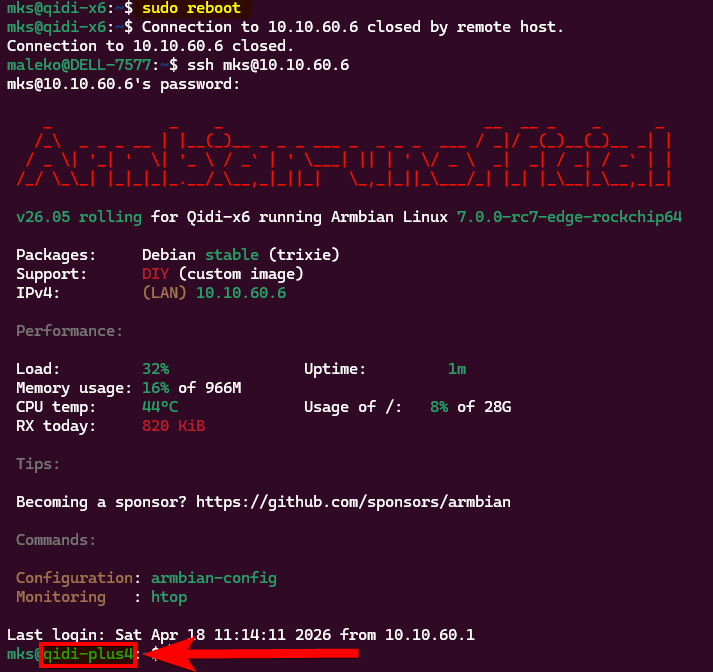](_IMAGE__Reboot-After-Hosts-Update.png)
> 

---

> ## 7.) UPDATE BASE OS
> ```
> sudo apt update && sudo apt upgrade -y
> ```
> [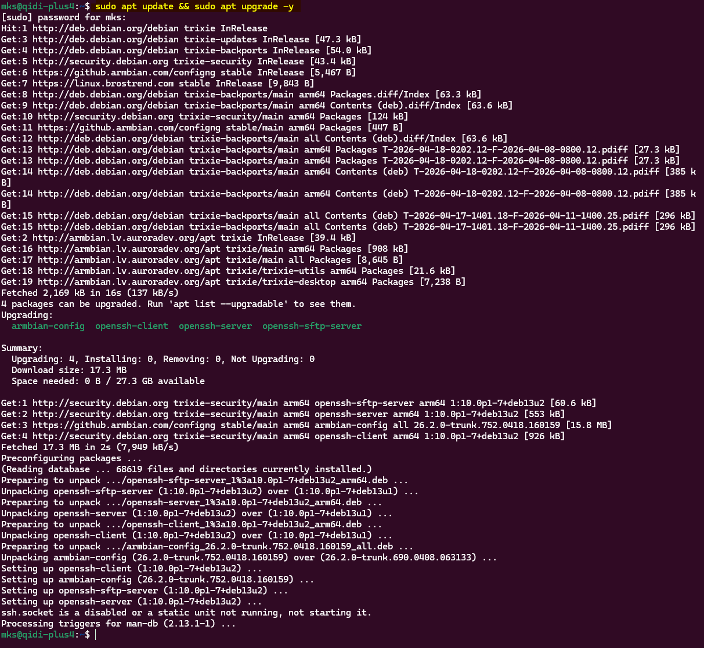](_IMAGE__Sudo-Apt-Update-Upgrade-Y.png)
> ```
> sudo reboot
> ```
> 
> ```
> ssh mks@<IP_ADDRESS>
> ```
> 
> ```
> <PASSWORD>
> ```
> 
> ```
> sudo apt update && sudo apt upgrade -y
> ```
> 
> [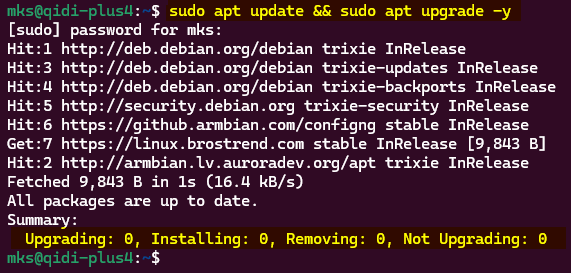](_IMAGE__System-Fully-Updated.png)
> 

---

> ## 8.) INSTALL ESSENTIAL 3D PRINTER SOFTWARE COMPONENTS
> 
> ### 8.1) KIAUH - KLIPPER INSTALLATION AND UPDATE HELPER
> 
> ```
> sudo apt-get update && sudo apt-get install git -y
> cd ~ && git clone https://github.com/dw-0/kiauh.git
> ./kiauh/kiauh.sh
> ```
> 
> [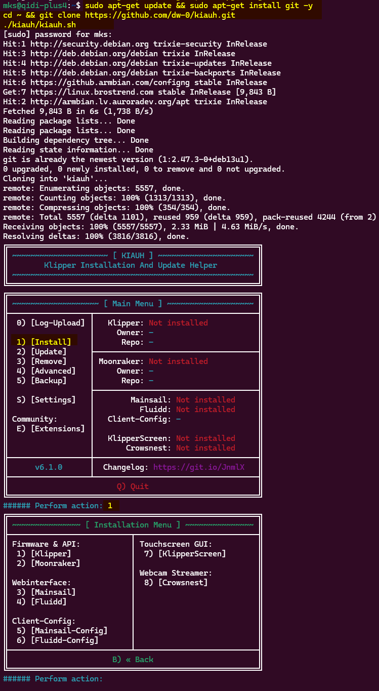](_IMAGE__Install-Launch-KIAUH.png)
> 
> #### INSTALL IN THE FOLLOWING ORDER:
> - Klipper
> - Moonraker
> - Mainsail --OR-- Fluidd
> - Crowsnest
> <br><br>
> #### KLIPPER
> [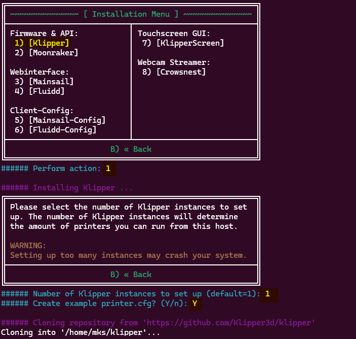](_IMAGE__KIAUH-Klipper-Install-001.png)
> [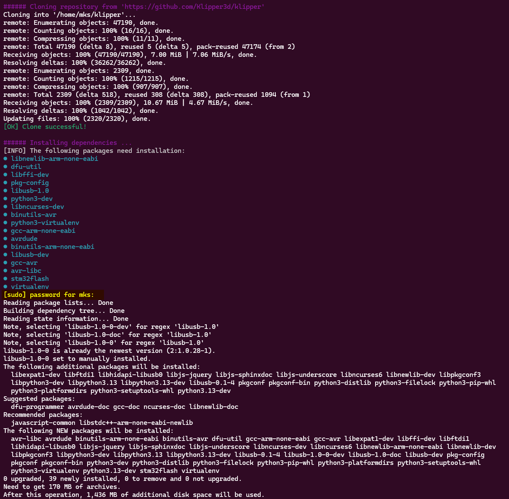](_IMAGE__KIAUH-Klipper-Install-002.png)
> [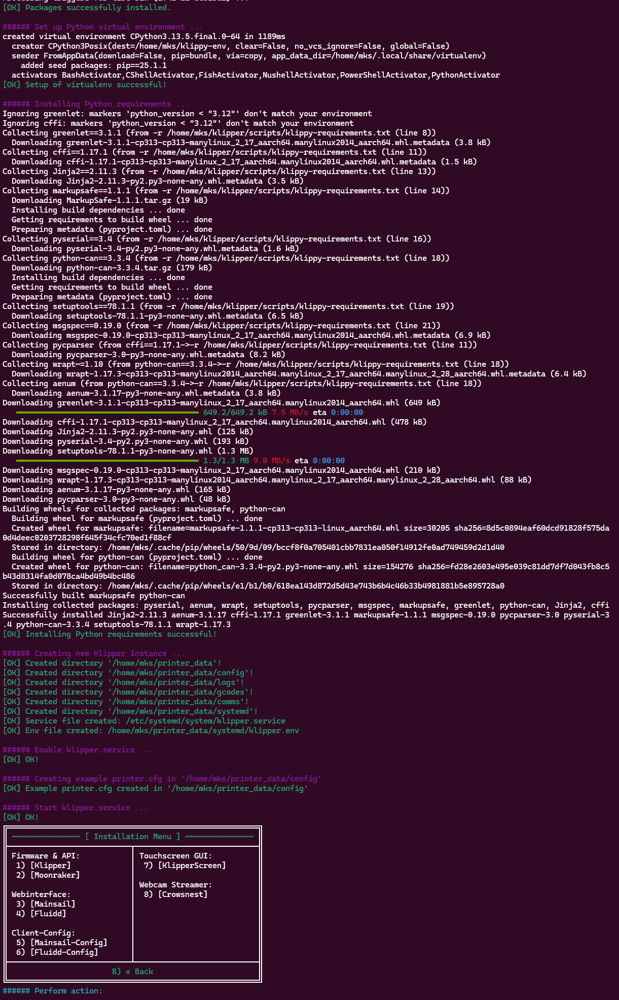](_IMAGE__KIAUH-Klipper-Install-003.png)
> <br><br>
> #### MOONRAKER
> [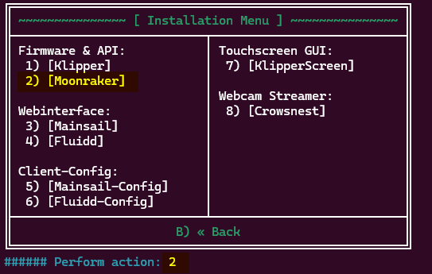](_IMAGE__KIAUH-Moonraker-Install-001.png)
> [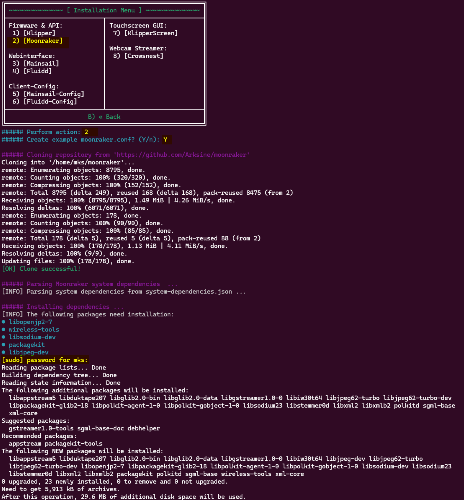](_IMAGE__KIAUH-Moonraker-Install-002.png)
> [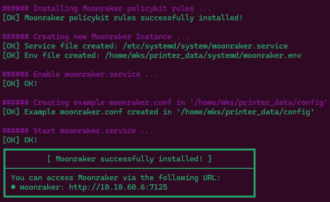](_IMAGE__KIAUH-Moonraker-Install-003.png)
> <br><br>
> #### MAINSAIL
> [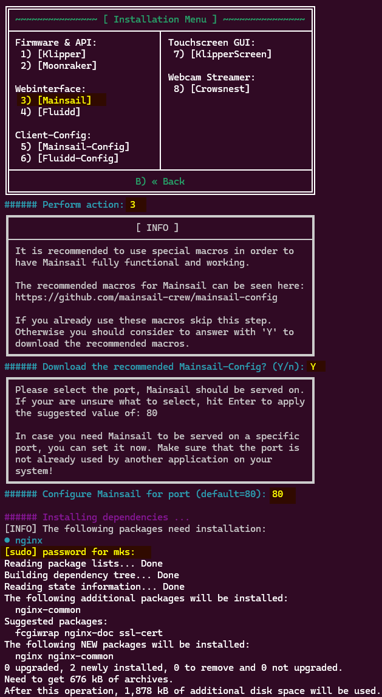](_IMAGE__KIAUH-Mainsail-Install-001.png)
> [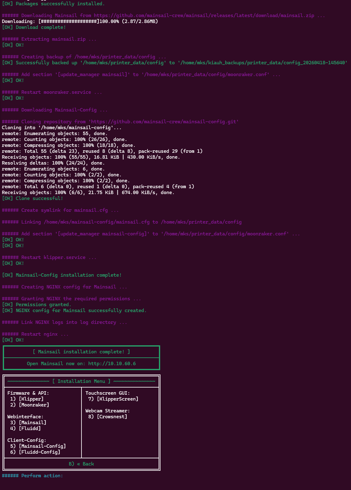](_IMAGE__KIAUH-Mainsail-Install-002.png)
> <br><br>
> #### CROWSNEST
> [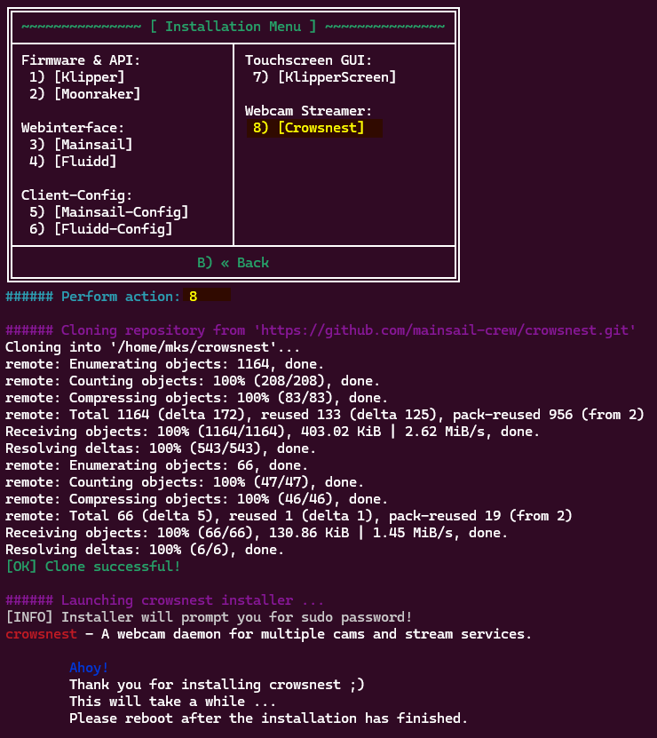](_IMAGE__KIAUH-Crowsnest-Install-001.png)
> [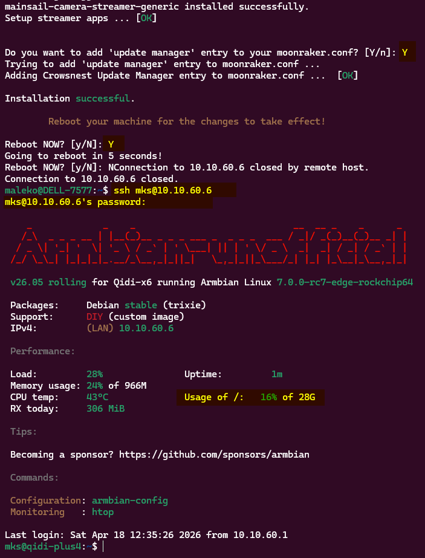](_IMAGE__KIAUH-Crowsnest-Install-002.png)
> <br><br>

---

> ### 8.2) MAKE A BACKUP BEFORE PROCEEDING FURTHER
> **[https://docs.vorondesign.com/community/howto/EricZimmerman/BackupConfigToGithub.html](https://docs.vorondesign.com/community/howto/EricZimmerman/BackupConfigToGithub.html)**

---

> ### 8.3) PREPARE FOR FreeDi INSTALLATION
> **[https://github.com/Phil1988/FreeDi/wiki/Tour-%232:-Adjusting-the-printer-config](https://github.com/Phil1988/FreeDi/wiki/Tour-%232:-Adjusting-the-printer-config)**

---

> ### 8.4) INSTALL FreeDi
> ```
> cd ~ && git clone https://github.com/Phil1988/FreeDi ~/FreeDi
> cd ~/FreeDi && ./install.sh
> ```
> 
> ### 8.5a) FLASH MAINBOARD MCU
> **NOTE:**<br>To put toolhead board in flashing mode, you must press and hold the boot button while you press the reset button, then release the reset button. there will be no lights or indications to speak of.
> ```
> cd ~
> git clone https://github.com/Arksine/katapult
> cd katapult
> make menuconfig
> ```
> 
> #### BUILD & FLASH KATAPULT
> [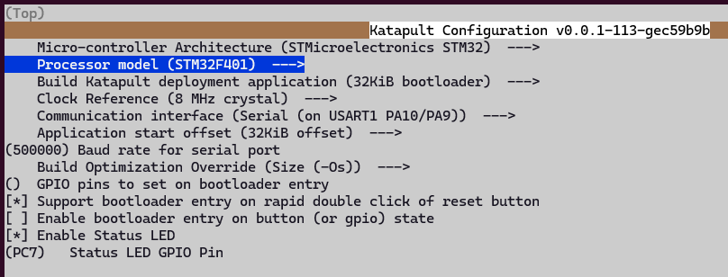](_IMAGE__Katapult__STM32F401__32k-bootloader_8MHz_USART1-PA10-PA9_32k-offset_500k-baud_BOO-0s_2xclick-reset_status-PC7-LED.png)
> 
> Press `q` then `y` to `quit and save`
> 
> Next, build the binaries
> ```
> make clean
> make -j4
> ```
> 
> Then request Mainboard MCU bootloader
> 
> ```
> cd ~/katapult/scripts
> python3 flashtool.py -b 500000 -d /dev/ttyS0 -r
> ```
> 
> Then flash `Katapult.bin` to `mainboard MCU`
> ```
> cd ~/katapult/scripts
> python3 flashtool.py -b 500000 -d /dev/ttyS0 -f ~/katapult/out/katapult.bin
> ```
> 
> Next, power cycle printer using
> ```
> sudo shutdown -h now
> ```
> `Wait 30 seconds` and `kill power` to printer
> 
> `Wait an additional 30 seconds once powered off` then `restore power` again
> 
> Once booted, `click center reset button on mainboard` to enter flashing mode again
> 
> **NOTE:**<br>the `red LED` and `white caselights` should be `blinking on and off` to let you know it is in `flashing mode`
> 
> #### BUILD & FLASH KLIPPER
> [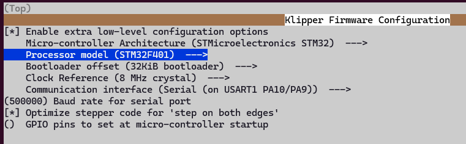](_IMAGE__Klipper__STM32F401__32k-bl-offset_8MHz_USART1-PA10-PA9_500k-baud_step-both-edges.png)
> 
> Press `q` then `y` to `quit and save`.
> 
> Next, build the binaries
> ```
> make clean
> make -j4
> ```
> 
> 